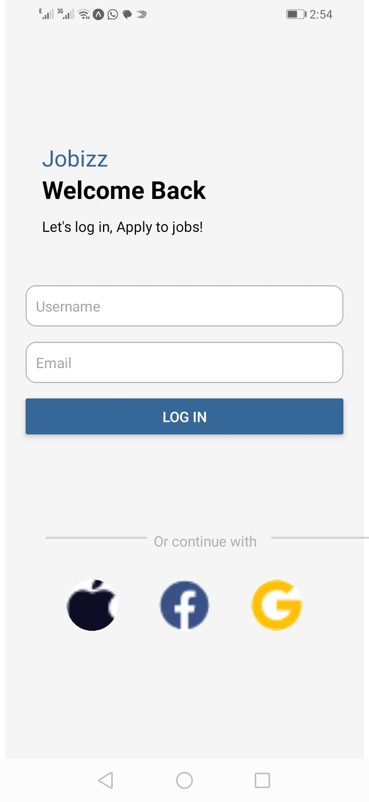

# HomeScreen Component
The HomeScreen component is designed to display a list of job opportunities and user details after successful login. The component utilizes several React Native elements and state management to create an interactive user interface.

Props:

 * route: Contains parameters passed during navigation, such as loginResult which includes the username and email of the user.
* State

  * SearchInput: Stores the text input value for job search.

Features

Displays user information (username and email).
Provides a search bar to search for job positions.
Lists featured and popular jobs using a combination of FlatList and custom views.
Uses inline styles and external stylesheets to style elements.

# LoginForm Component
The LoginForm component provides a user interface for logging in, allowing users to enter their username and email. Upon successful login, it navigates to the HomeScreen and passes the login details.

State:

* userDetails: Stores the username and email entered by the user.
Features:

* Two TextInput fields for username and email.
A login button that triggers navigation to the HomeScreen.
Additional social media login options displayed as images within circular borders.

Image for loginScreen

